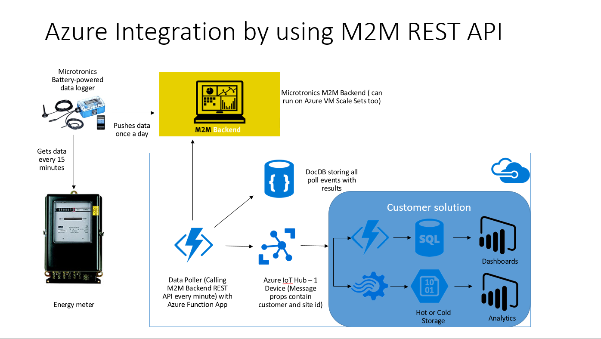

# Microtronics Azure IoT Hub Connector
This is a sample showing how to connect and integrate [Microtronics rapidM2M Backend ](https://www.microtronics.at/en/products/m2m-platform.html)
service to [Azure IoT Hub](https://azure.microsoft.com/en-us/services/iot-hub/). Warning: **Not production ready code**. Check constraints section below.



### How it works

Using a time triggered [Azure Function App](https://azure.microsoft.com/en-us/services/functions/) (Azure's serverless implementation) the Microtronics m2m Backend middleware is called regularly (default setting is once a minute) via its REST API by using the 'Site's time series data' method to retrieve the newest available telemetry data. Polling requests and their results get stored in an [Azure DocumentDB](https://azure.microsoft.com/en-us/services/documentdb/) collection and are finally forwarded to Azure IoT Hub.  

### Installation 
You will need the following components to use or run this sample:

1. Azure subscription (You can get one for free [here](https://azure.microsoft.com/en-us/free/)) with Azure DocumentDB account and Azure IoT Hub instance deployed
2. Visual Studio 2015 (at least Community edition) with Git support
3. Access to a Microtronics M2M Backend instance ([playground works too](https://www.microtronics.at/en/service/cloud_service.html))

### Configuration
- Scheduling for the Function App time trigger can be found in the file located at .\rapidM2MPoller\rapidM2MForwarding\function.json. For more details on configuring Time triggered Azure functions see the documentation on the [Azure website](https://docs.microsoft.com/en-us/azure/azure-functions/functions-bindings-timer).
- Application configuration can be found in the file .\rapidM2MPoller\application.json.
    - M2MBackendURL: URL of the Microtronics m2m Backend service installation
    - Base64encodedUsernamePassword: Base64 encoded username and password (see [Microtronics API documentation](http://support.mydatanet.at/quick_guide/ApiDocumentationV1.pdf))
    - Customer_ID: customer identifier from Microtronics installation
    - Site_ID: site identifier from Microtronics installation
    - EmulationMode: True or False. On True no data from m2m Backend will be polled
    - M2MDocumentsDBUri: Azure DocumentDB database Uri. Database and collection will be created if not existing
    - M2MDocumentsDBPrimaryKey: Primary key from the Azure DocumentDB account
    - IoTHubURL: Hostname of the Azure IoT Hub instance like [yourname].azure-devices.net 
    - IoTHubDeviceId: Device Id for the Azure IoT Hub (must be registered on IoT Hub)
    - IoTHubSharedAccessSignature: Shared access signature for the IoT Hub device, e.g. generated by Device Explorer App

### Constraints
- Only one Microtronic's customer site/device currently supported
- Function must not be called multiple times. No concurrent support yet
- No extensive failure handling implemented and no retry logic

### Sample output message

```
{
    "customer_id": "Your customer Id",
    "site_id": "Energy meter 1",
    "Timerange": {
      "begin": "0001-01-01T00:00:00",
      "end": "2017-02-16T13:09:24.7744931-08:00"
    },
    "Timeseries": [
      {
        "Timestamp": "2017-01-26T13:30:00",
        "Channels": {
          "ch0": 51000
        }
      }
    ]
  }
  ```




